# Networking & Linux Basics

## Definisi Bourne-Again Shell (BASH)
Bash merupakan shell yang paling umum digunakan pengguna Linux.  Bash sripting  adalah pemrograman kumpulan perintah menggunakan script yang ditulis ke dalam bash shell, sehingga nantinya dapat dieksekusi oleh sistem operasi.


## Install Nginx
- Pertama lakukan install **_nginx_**. bisa gunakan perintah dibawah ini.
```bash
  sudo apt install nginx
```
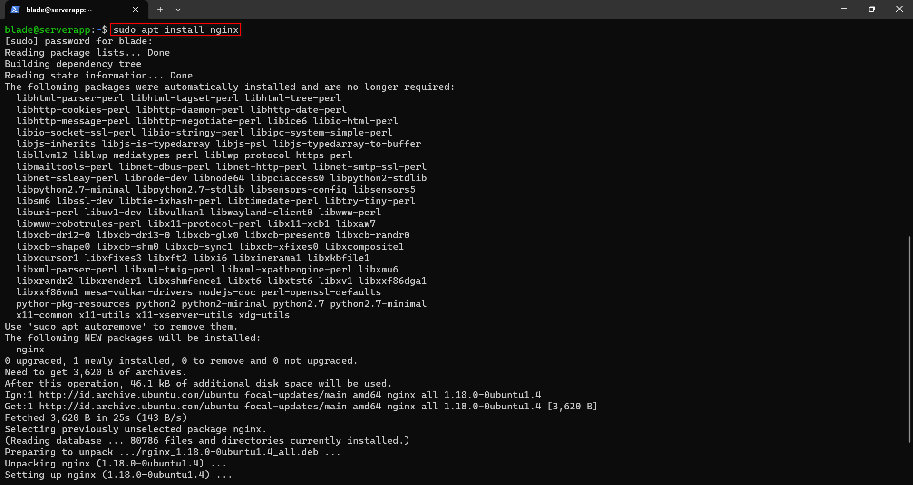

- Jika install sudah selesai bisa cek dengan menggunakan perintah dibawah ini.
```bash
  sudo systemctl status nginx
```
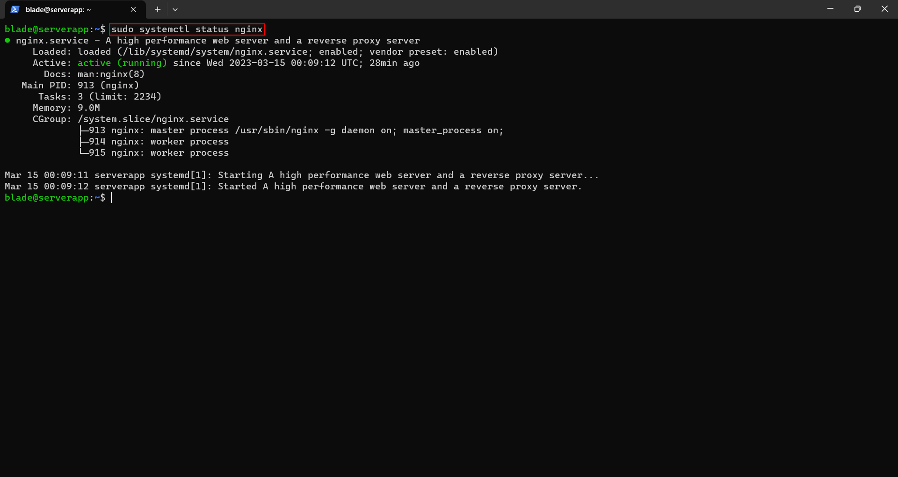

- Sekarang buka browser dan masukkan IP dari server.

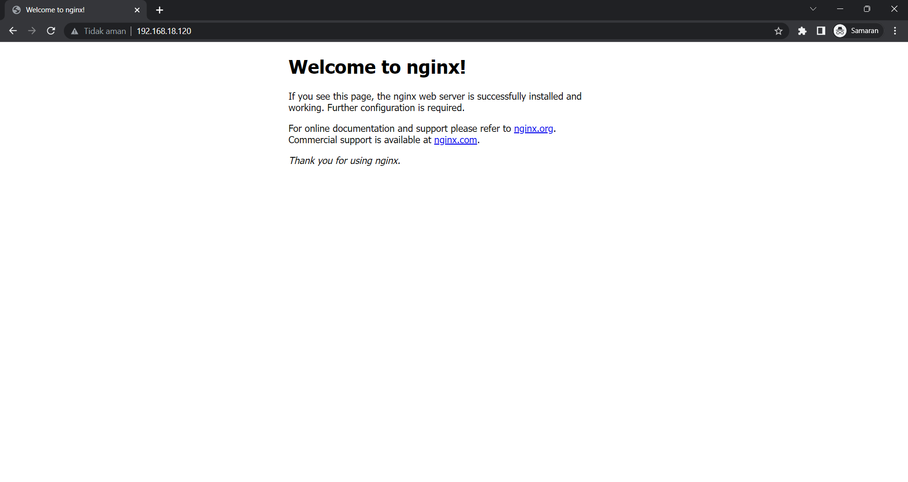


## Command Linux Shell
- mkdir : perintah untuk membuat suatu directory.

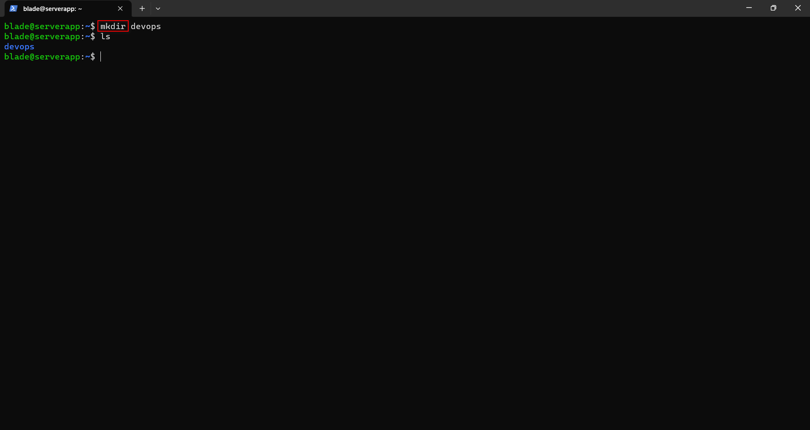

- cd    : perintah untuk masuk ke dalam directory.


- touch : perintah untuk membuat suatu file.

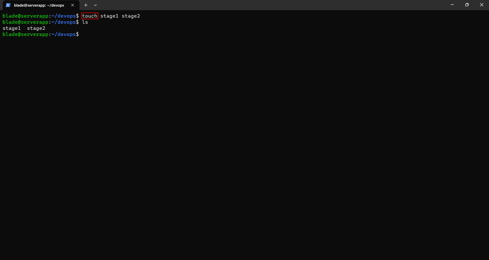

- ls    : perintah untuk melihat list apa saja yang ada di directory.

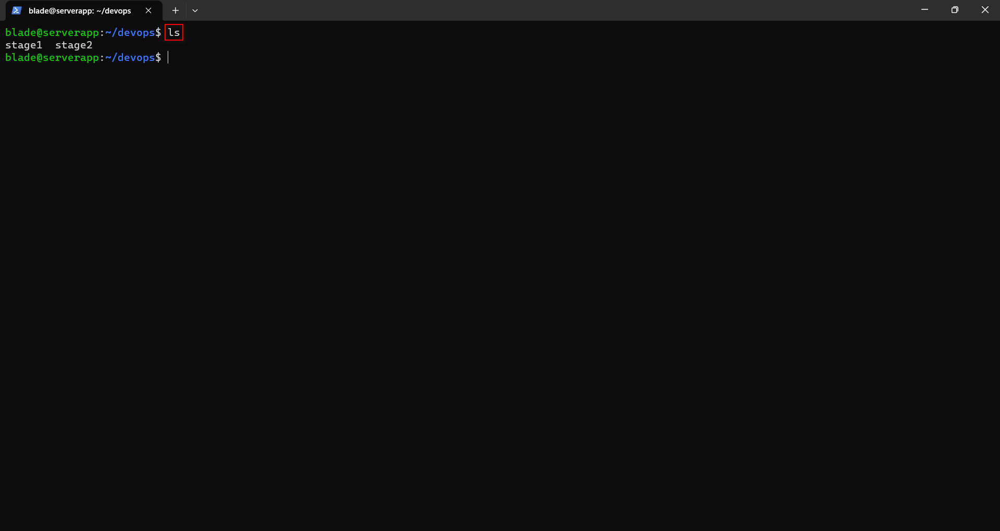

- rm    : perintah untuk menghapus suatu file.

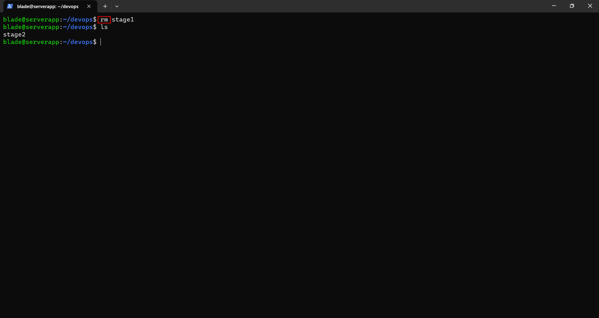


## Perbedaan IP Public & IP Private
- IP Public bersifat **_worlwide_**, bisa digunakan untuk mengakses internet namun penggunaan atau konfigurasinya tidak bebas (ada yang mengatur).
- IP Private hanya bersifat lokal & tidak bisa digunakan untuk mengakses internet & penggunaannya bebas.


## Perbedaan _Client-to-Server_ & *Peer-to-Peer*
- **_Client-to-Server_** adalah suatu jaringan komputer dimana salah satu komputer yang bertindak sebagai **_server_** dan komputer lain berperan sebagai **_client_**.

- **_Peer-to-Peer_** adalah suatu jaringan komputer dimana peranan **_server_** dan peranan **_client_** dapat dilakukan oleh semua komputer (secara bersamaan).


## Install Localtunnel
- Pertama-tama lakukan instalasi **_node.js_** menggunakan **_nvm_**. bisa gunakan perintah dibawah ini.
```bash
  sudo apt install curl
```
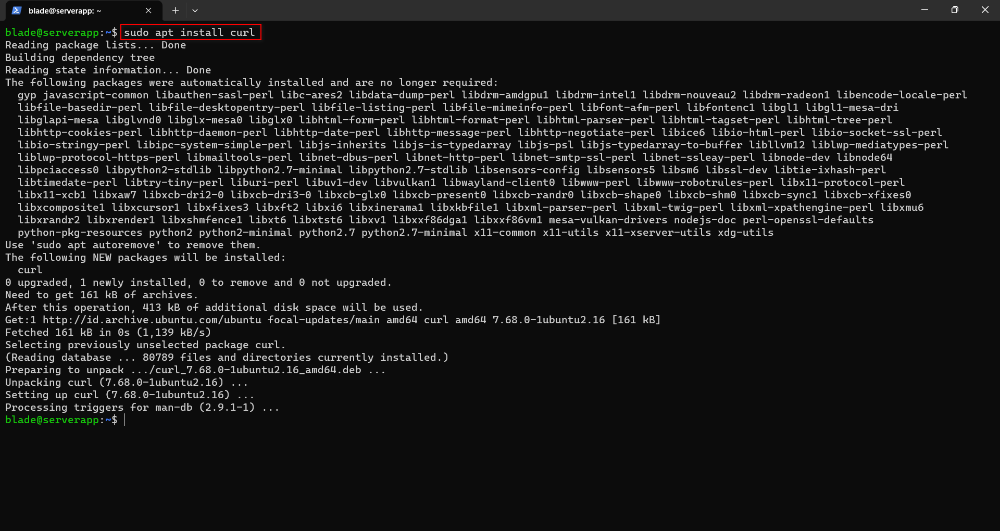

```bash
  curl -o- https://raw.githubusercontent.com/nvm-sh/nvm/v0.39.3/install.sh | bash
```
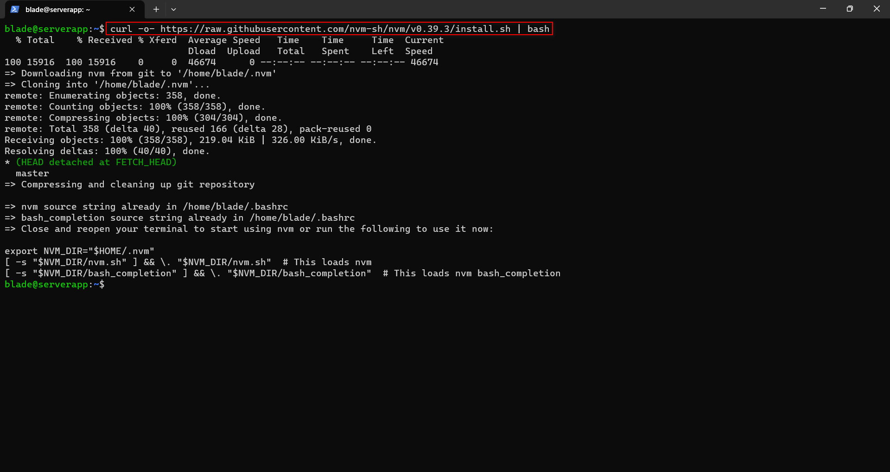

```bash
  exec bash
```
```bash
  nvm install 14
```
```bash
  node -v
```
```bash
  npm -v
```
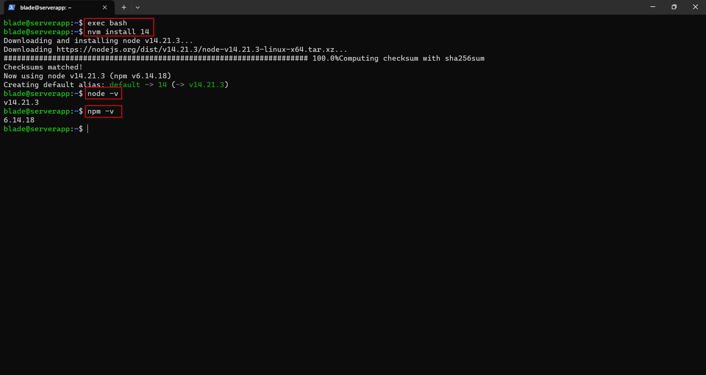

- Kemudian Instalasi **_localtunnel_** menggunakan npm yang sudah diinstall.
```bash
  npm install -g localtunnel
```
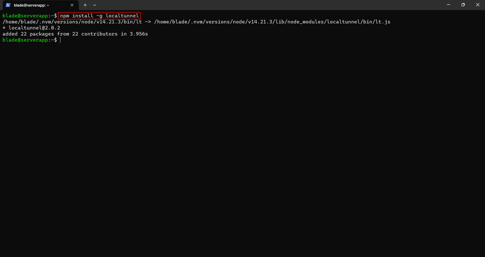

- Karena sudah menginstall **_nginx_** sebelumnya maka untuk menjalankan **_localtunnel_** dapat mengikuti perintah di bawah ini. (bagi yang belum install **_nginx_** bisa dilihat [diatas](#install-nginx))
```bash
  lt --port 80
```
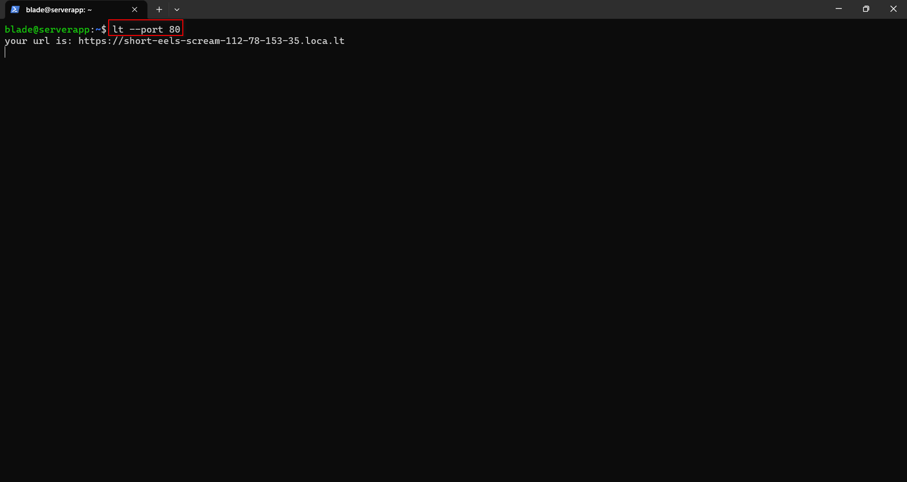
*keterangan: pastikan port dengan sesuai dengan aplikasi. Karena setiap aplikasi mempunyai port yang berbeda-beda.*

- **_copy_** url di terminal lalu jalankan di web/smartphone browser.
<p align="center">
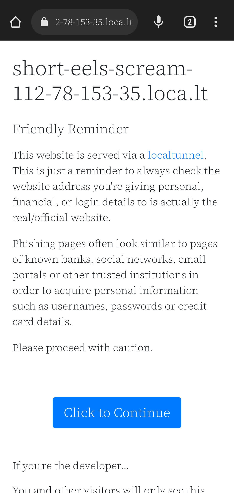
</p>

- Jika sudah klik tombol `Click to Continue` akan diarahkan ke aplikasi. Dan aplikasi sekarang sudah dapat diakses publik.

<p align="center">
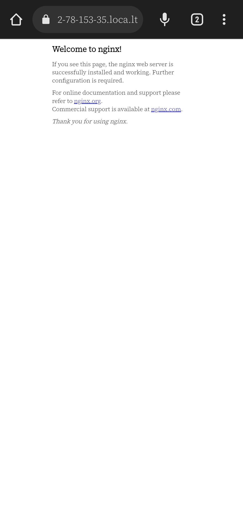
</p>