# Kelompok 1
Anggota :
- M. Yayang Setiawan
- Muhamad Nafis

# Docker
**Docker** adalah perangkat lunak yang dapat digunakan untuk membuat, menguji, dan menerapkan aplikasi dengan cepat. Docker menjadikan perangkat lunak ke dalam unit yang disebut container, dimana di dalamnya memiliki semua yang diperlukan perangkat lunak agar dapat berfungsi termasuk aplikasi dan dependencies.

## Requirements

- Buat 3 VM dengan spesifikasi sebagai berikut :

|      VM      |  CPU  |  RAM  | Storage |
|    :---:     | :---: | :---: |  :---:  | 
|  Appserver   |   2   | 2 GB  |  20 GB  |
|   Gateway    |   1   | 1 GB  |  20 GB  |
|    CI/CD     |   2   | 2 GB  |  20 GB  |

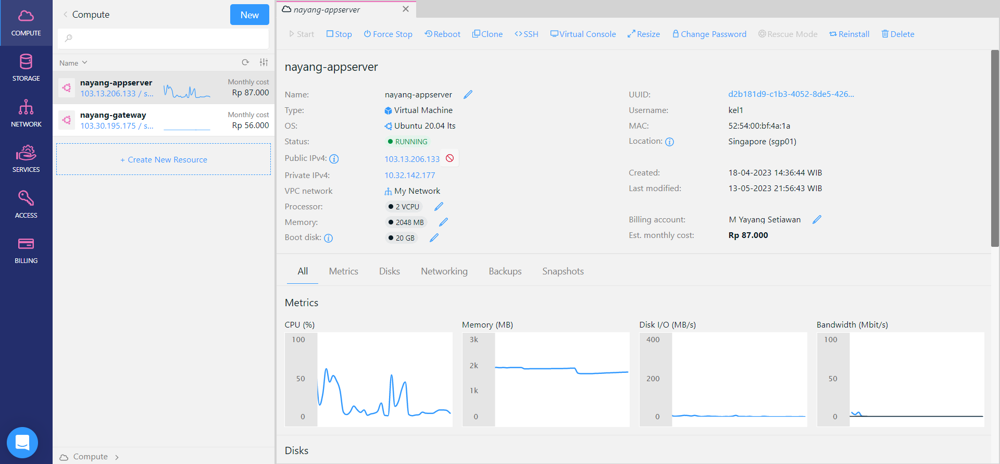

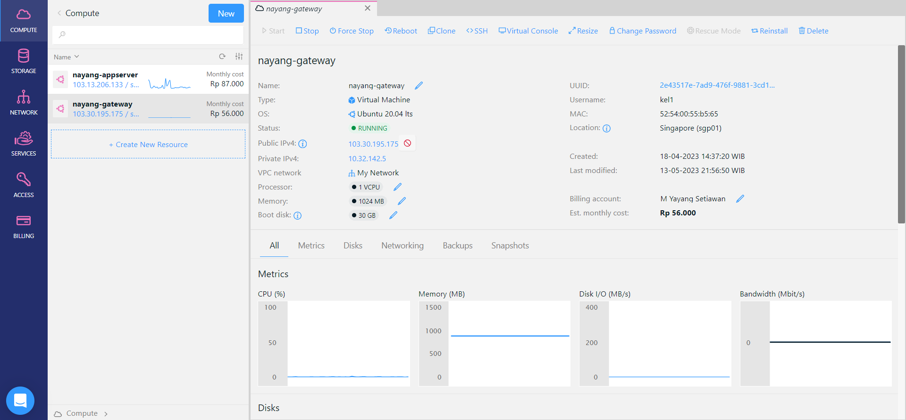

## Setup Docker 
Untuk Petunjuk instalasi Docker bisa dilihat pada [Docker](https://docs.docker.com/engine/install/ubuntu/) dan [Digital Ocean](https://www.digitalocean.com/community/tutorials/how-to-install-and-use-docker-on-ubuntu-20-04).

- Pertama, install Docker di dalam server yang telah dibuat. Bisa gunakan perintah dibawah ini.

```
sudo apt-get update
sudo apt-get install ca-certificates curl gnupg
```


```
sudo install -m 0755 -d /etc/apt/keyrings
curl -fsSL https://download.docker.com/linux/ubuntu/gpg | sudo gpg --dearmor -o /etc/apt/keyrings/docker.gpg
sudo chmod a+r /etc/apt/keyrings/docker.gpg
```


```
echo \
  "deb [arch="$(dpkg --print-architecture)" signed-by=/etc/apt/keyrings/docker.gpg] https://download.docker.com/linux/ubuntu \
  "$(. /etc/os-release && echo "$VERSION_CODENAME")" stable" | \
  sudo tee /etc/apt/sources.list.d/docker.list > /dev/null
```


```
sudo apt-get update
```


```
sudo apt-get install docker-ce docker-ce-cli containerd.io docker-buildx-plugin docker-compose-plugin
```


```
docker -v
```


- Kemudian setup untuk root command docker yang akan dipakai nantinya agar saat menggunakan command docker tersebut sudah tidak perlu menggunakan perintah sudo. Bisa gunakan perintah dibawah ini.

```
sudo usermod -aG docker (user)
```
> keterangan : perintah di atas ini adalah suatu perintah untuk mengizinkan user yang digunakan agar dapat menjalankan perintah docker tanpa menggunakan perintah sudo.


## Deploy Aplikasi on Top Docker
### Frontend

- git clone repository `Wayshub Frontend`.

```
git clone https://github.com/dumbwaysdev/wayshub-frontend
```

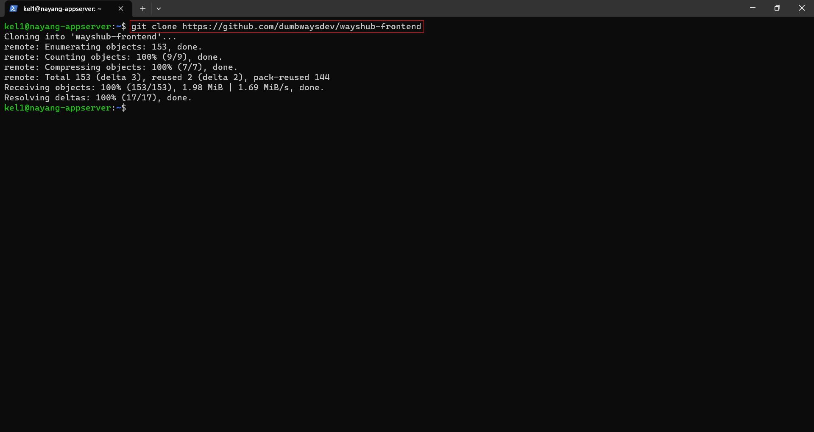

- Kemudian Intregasikan Frontend dan Backend. Lalu membuat `Dockerfile`. 

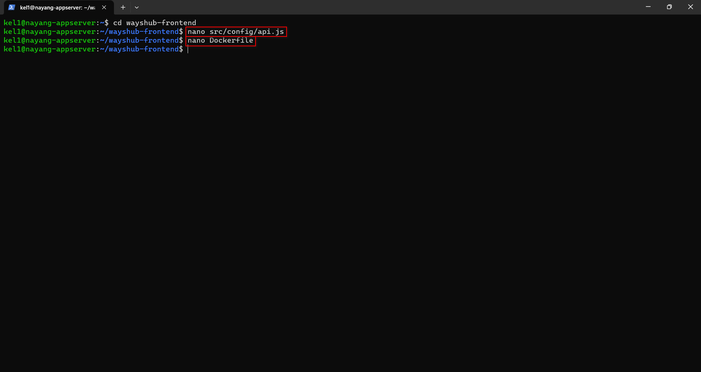

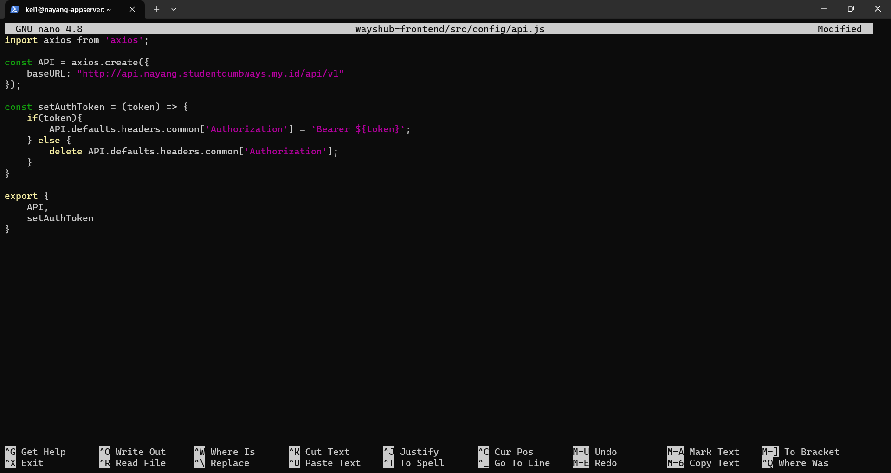


### Database

- Membuat docker mysql dan menjalankan dengan docker compose.

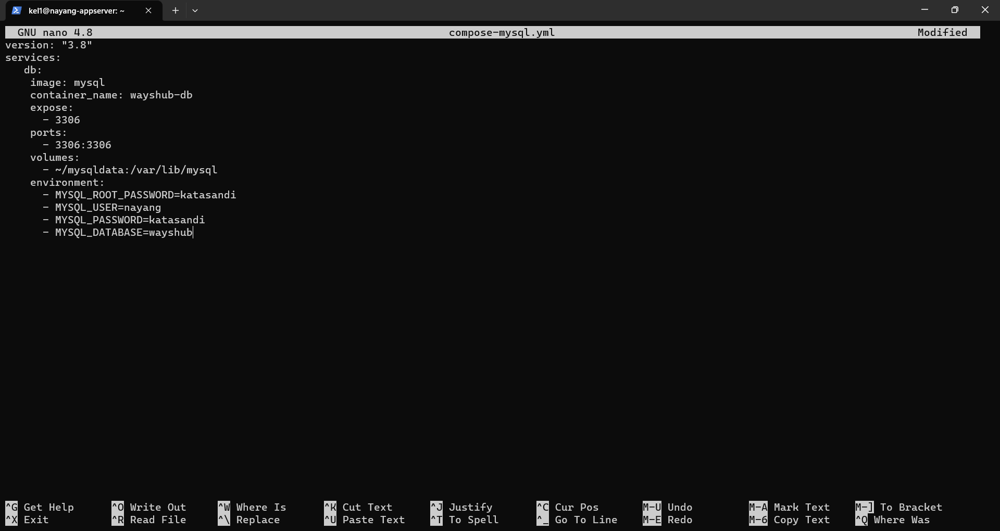

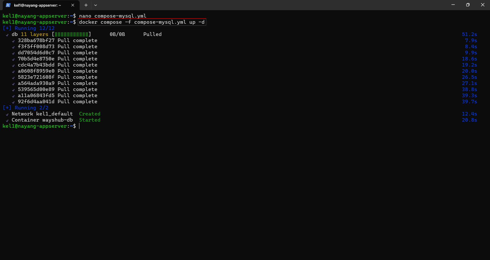

- Kemudian membuat user database.

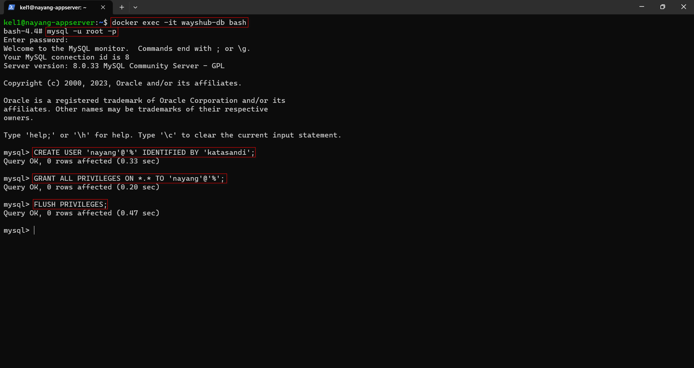

### Backend

- - git clone repository `Wayshub Backend`.

```
git clone https://github.com/dumbwaysdev/wayshub-backend
```

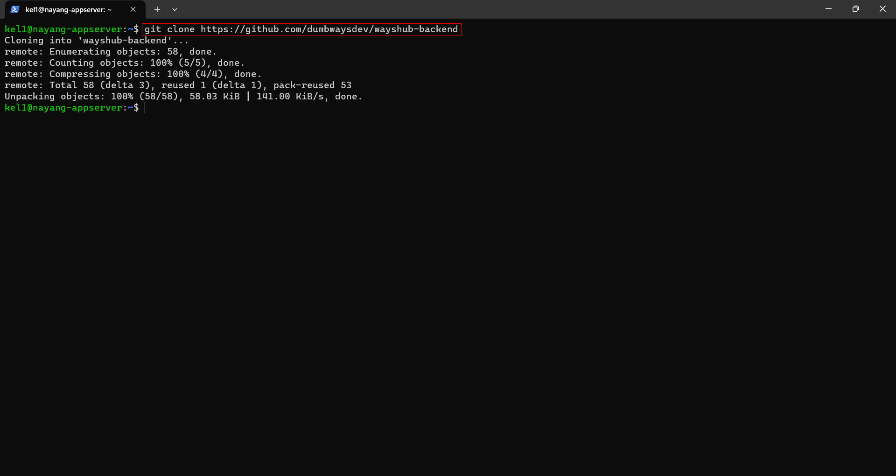

- - Kemudian Intregasikan Backend dan Database. Lalu membuat `Dockerfile`.


### Docker Compose
- Membuat Docker compose dan menjalankannya.


### Docker Push Images 
- Kemudian melakukan login ke dalam `docker.hub` di dalam terminal.
```
docker login
```


- Kemudian memberikan tag dan push pada Image
```
docker tag kel1-frontend myyngstwn/wayshub-frontend
```

```
docker push myyngstwn/wayshub-frontend
```


## Konfigurasi Reverse Proxy

- Kemudian membuat reverse proxy dan serta certbot sertifikasi pada aplikasi wayshub-frontend dan wayshub-backend.

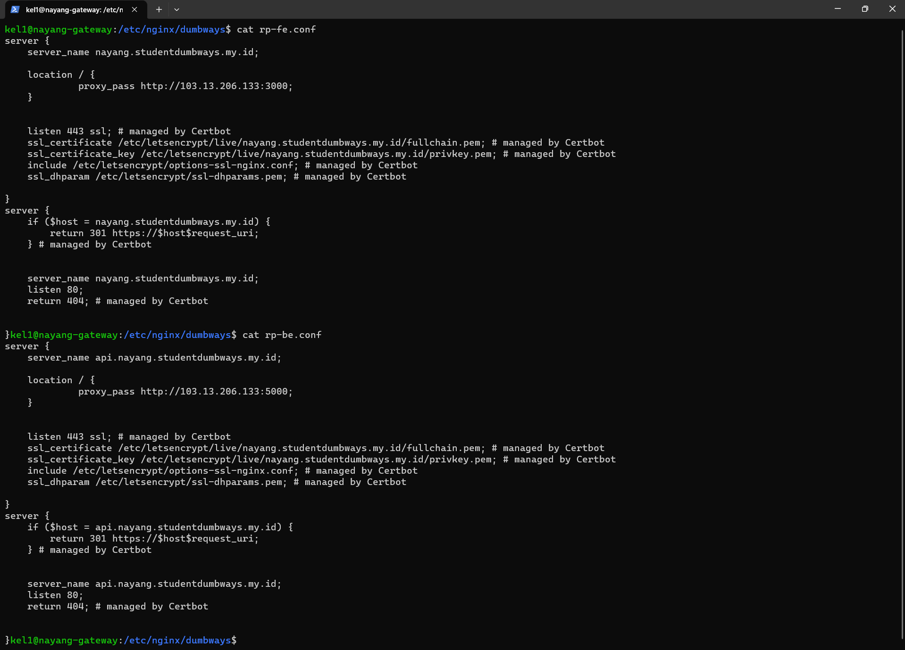

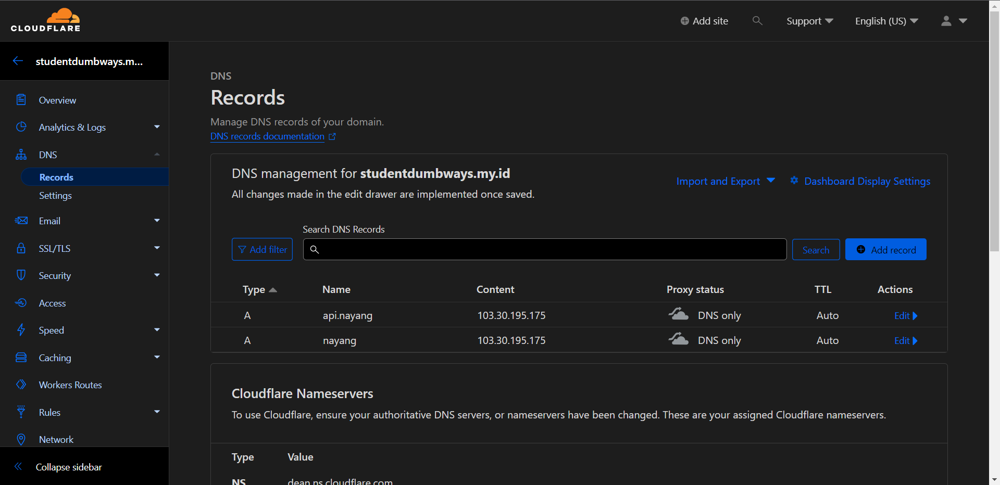

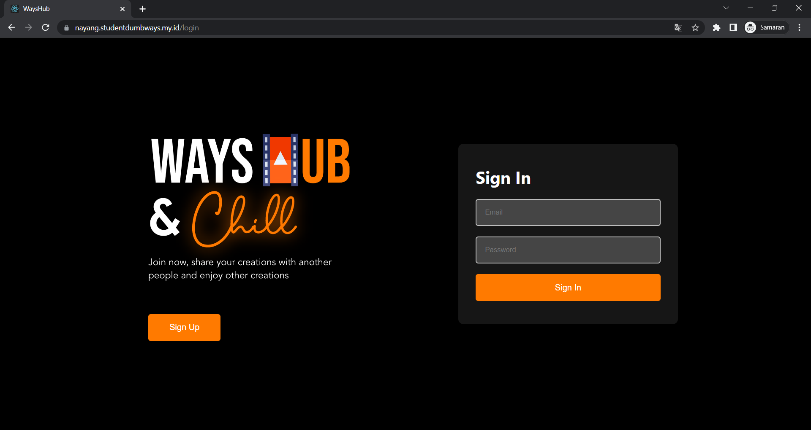

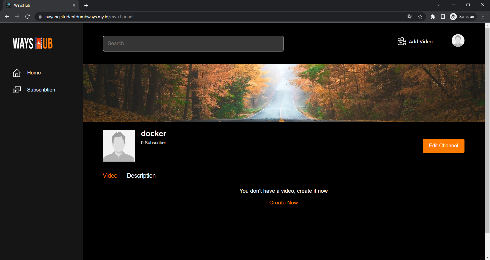

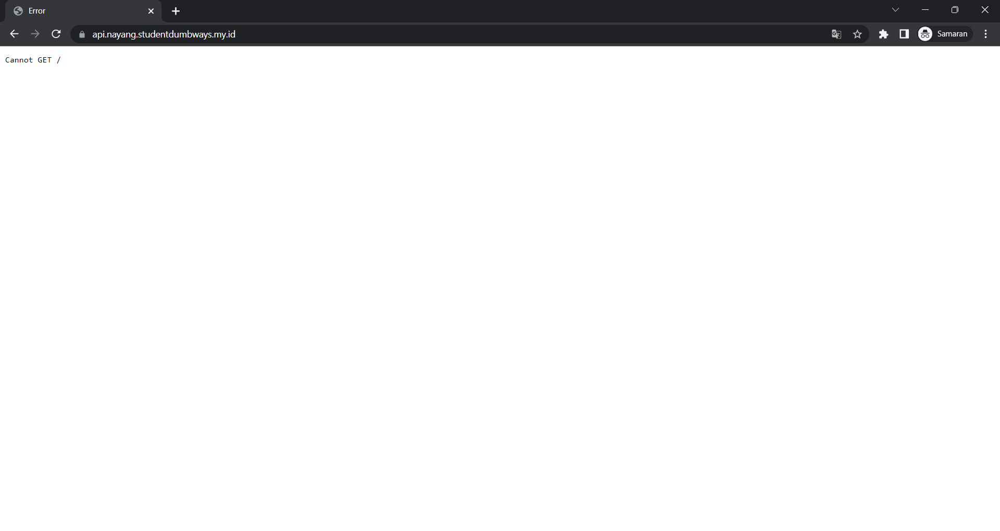