# CI/CD : Jenkins

# Jenkins on Top Docker

- Pertama membuat docker-compose terlebih dahulu. Lalu jalankan dengan docker compose.

```
version: '3.8'
services:
   jenkins:
      image: jenkins/jenkins:lts-jdk11
      container_name: jenkins
      restart: always
      privileged: true
      user: root
      ports:
         - 8080:8080
         - 50000:50000 
      volumes:
         - ~/jenkins:/var/jenkins_home
```
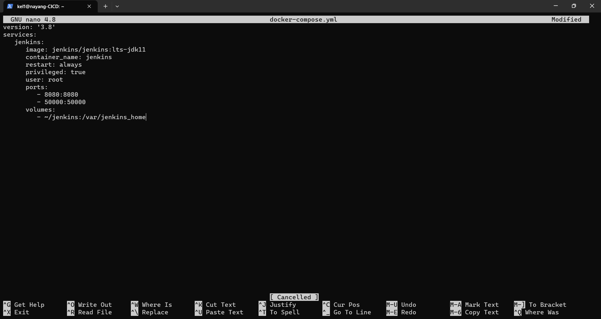

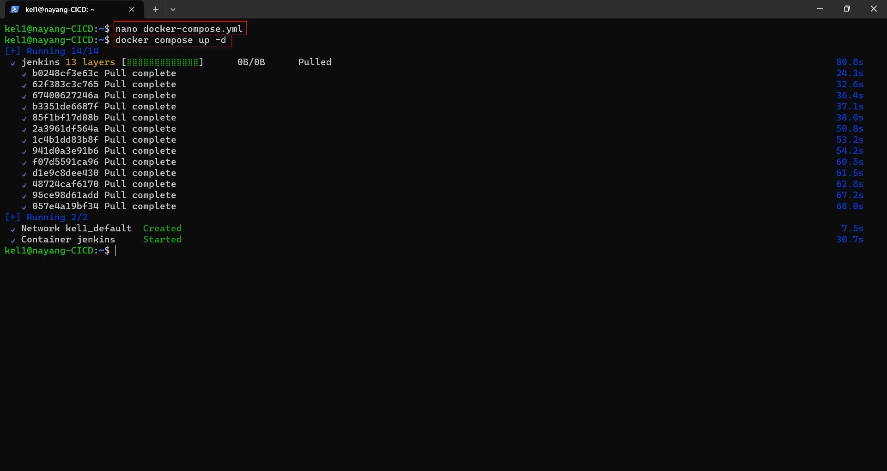

- Pada saat pertama kali akan diminta untuk memasukan password yang sudah di generate secara random oleh jenkins letaknya ada di `/var/jenkins_home/secrets/initialAdminPassword`

- Kemudian masukkan password tersebut untuk bisa mengakses jenkins. pada instalasi plugin pilih `recommend plugin`.setelah installasi plugin selesai maka akan diarahkan untuk `Create First Admin User` dan `Instance Configuration`.

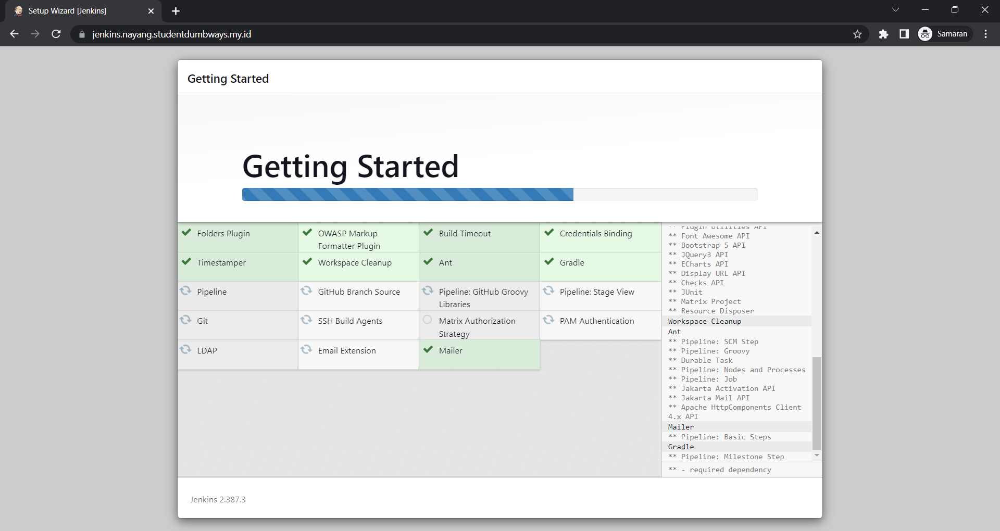

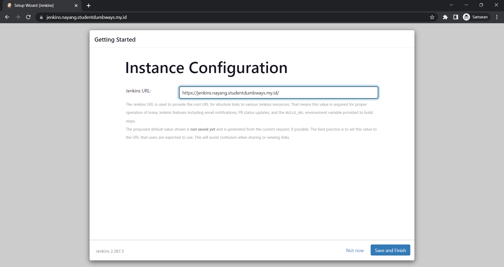

- Dan Jenkins telah siap digunakan.

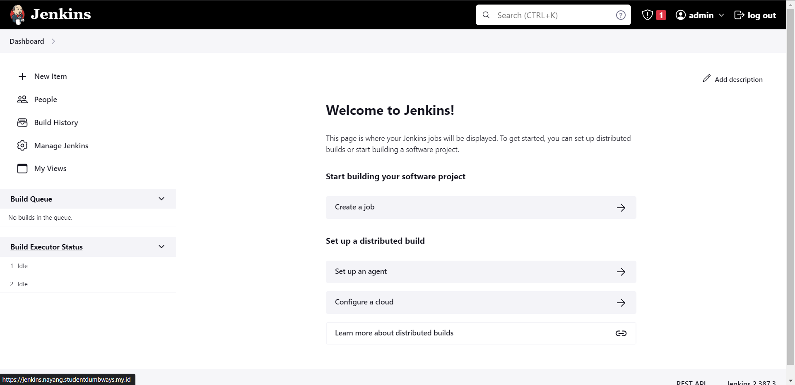

## Menghubungkan Jenkins dengan Server

- Kemudian Konfigurasi ***Manage Credentials***  dan hubungkan Jenkins dengan VPS server dengan menambahkan ssh-keygen.
> - public key dimasukan di dalam authorized keys. 
> - private key diletakan pada ***user Credentials***.

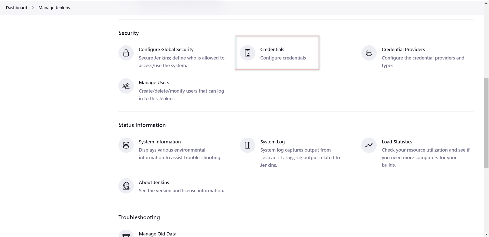

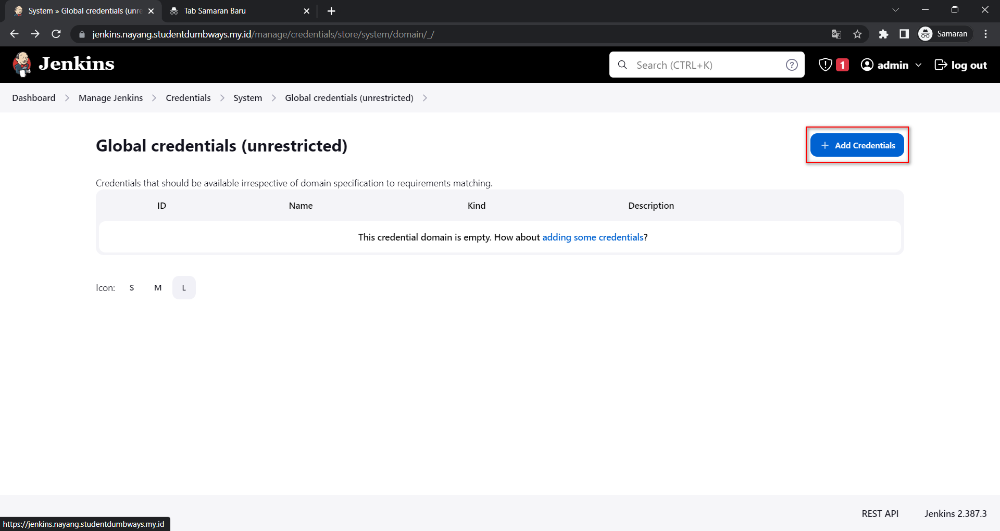

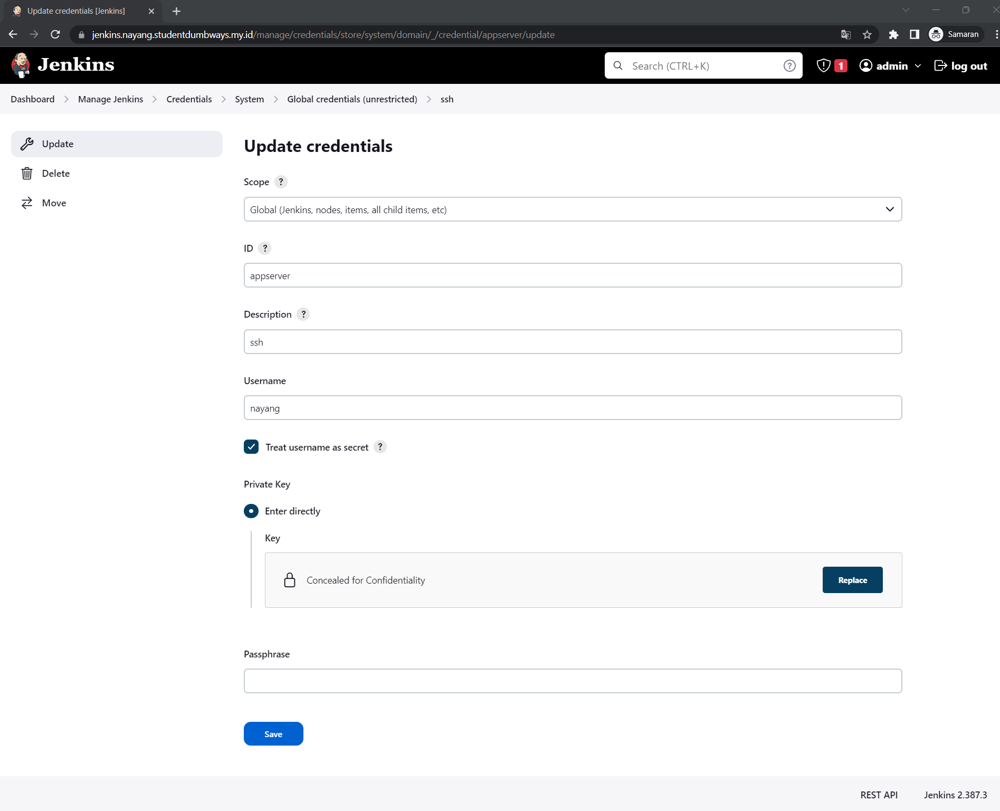

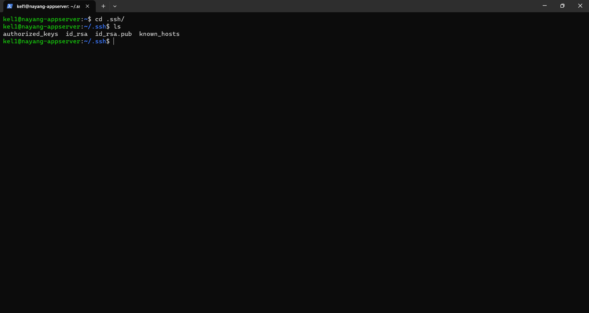

- Kemudian tambahkan plugin ssh pada jenkins agar bisa menggunakan koneksi ssh. 

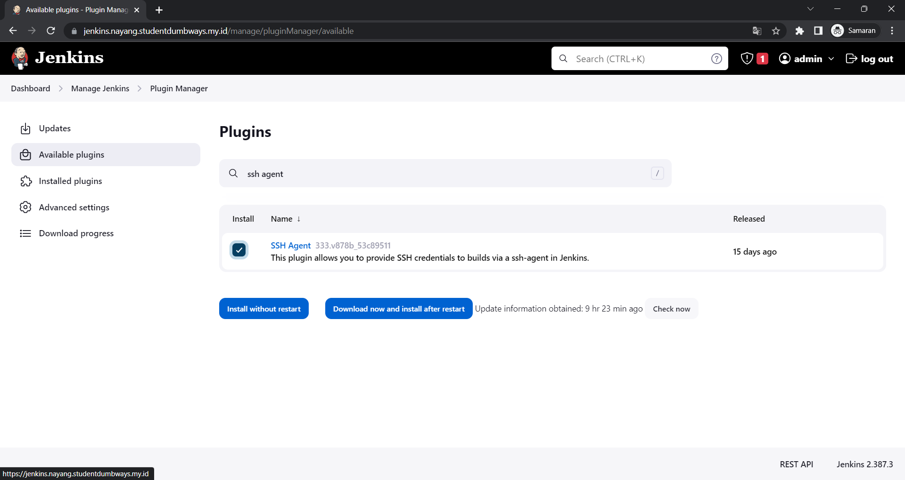

## Membuat Jenkinsfile Frontend dan Backend
- untuk membuat pipeline di butuhkan file bernama `Jenkinsfile`.


```
def branch = "main"
def repo = "https://github.com/myayangs/wayshub-frontend.git"
def cred = "appserver"
def dir = "~/wayshub-frontend"
def server = "kel1@103.13.206.133"
def imagename = "wayshub-fe"
def dockerusername = "myyngstwn"

pipeline {
    agent any

    stages {
        stage('Pull From Repository') {
            steps {
                sshagent([cred]) {
                    sh """ssh -o StrictHostKeyChecking=no ${server} << EOF
                        cd ${dir}
                        git remote add origin ${repo} || git remote set-url origin ${repo}
                        git pull origin ${branch}
                        exit
                        EOF
                    """
                }
            }
        }

    stage('Dockerize') {
            steps {
                sshagent([cred]) {
                    sh """ssh -o StrictHostKeyChecking=no ${server} << EOF
                        cd ${dir}
                        docker build -t ${imagename}:latest .
                        exit
                        EOF
                    """
                }
            }
        }

        stage('Deploy Docker') {
            steps {
                sshagent([cred]) {
                    sh """ssh -o StrictHostKeyChecking=no ${server} << EOF
                        cd ${dir}
                        docker container stop ${imagename}
                        docker container rm ${imagename}
                        docker run -d -p 3000:3000 --name="${imagename}"  ${imagename}:latest
                        docker container stop ${imagename}
                        docker container rm ${imagename}
                        exit
                        EOF
                    """
                }
            }
        }

        stage('Push to Docker Hub') {
            steps {
               sshagent([cred]) {
			    sh """ssh -o StrictHostKeyChecking=no ${server} << EOF
				    docker tag ${imagename}:latest ${dockerusername}/${imagename}:latest
				    docker image push ${dockerusername}/${imagename}:latest
				    docker image rm ${dockerusername}/${imagename}:latest
				    docker image rm ${imagename}:latest
				    exit
                    EOF
			"""
		        }
            }
        }
    }
}
```

```
def branch = "main"
def repo = "https://github.com/myayangs/wayshub-backend.git"
def cred = "appserver"
def dir = "~/wayshub-backend"
def server = "kel1@103.13.206.133"
def imagename = "wayshub-be"
def dockerusername = "myyngstwn"

pipeline {
    agent any

    stages {
        stage('Pull From Repository') {
            steps {
                sshagent([cred]) {
                    sh """ssh -o StrictHostKeyChecking=no ${server} << EOF
                        cd ${dir}
                        git remote add origin ${repo} || git remote set-url origin ${repo}
                        git pull origin ${branch}
                        exit
                        EOF
                    """
                }
            }
        }

    stage('Dockerize') {
            steps {
                sshagent([cred]) {
                    sh """ssh -o StrictHostKeyChecking=no ${server} << EOF
                        cd ${dir}
                        docker build -t ${imagename}:latest .
                        exit
                        EOF
                    """
                }
            }
        }

        stage('Deploy Docker') {
            steps {
                sshagent([cred]) {
                    sh """ssh -o StrictHostKeyChecking=no ${server} << EOF
                        cd ${dir}
                        docker container stop ${imagename}
                        docker container rm ${imagename}
                        docker run -d -p 5000:5000 --name="${imagename}"  ${imagename}:latest
                        docker container stop ${imagename}
                        docker container rm ${imagename}
                        exit
                        EOF
                    """
                }
            }
        }

        stage('Push to Docker Hub') {
            steps {
               sshagent([cred]) {
			    sh """ssh -o StrictHostKeyChecking=no ${server} << EOF
				    docker tag ${imagename}:latest ${dockerusername}/${imagename}:latest
				    docker image push ${dockerusername}/${imagename}:latest
				    docker image rm ${dockerusername}/${imagename}:latest
				    docker image rm ${imagename}:latest
				    exit
                    EOF
			"""
		        }
            }
        }
    }
}
```

## Membuat Pipeline
## Konfigurasi Reverse Proxy
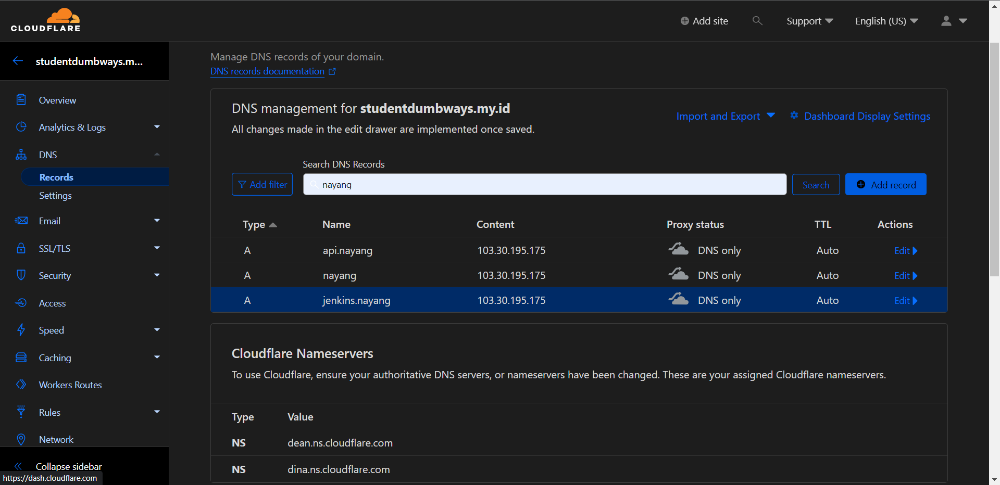
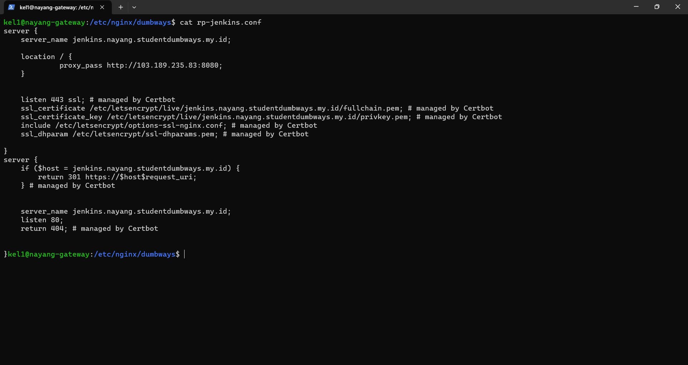