# Terraform

- Install **Terraform**. Bisa gunakan perintah dibawah ini.
```
wget -O- https://apt.releases.hashicorp.com/gpg | sudo gpg --dearmor -o /usr/share/keyrings/hashicorp-archive-keyring.gpg
echo "deb [signed-by=/usr/share/keyrings/hashicorp-archive-keyring.gpg] https://apt.releases.hashicorp.com $(lsb_release -cs) main" | sudo tee /etc/apt/sources.list.d/hashicorp.list
sudo apt update && sudo apt install terraform
```
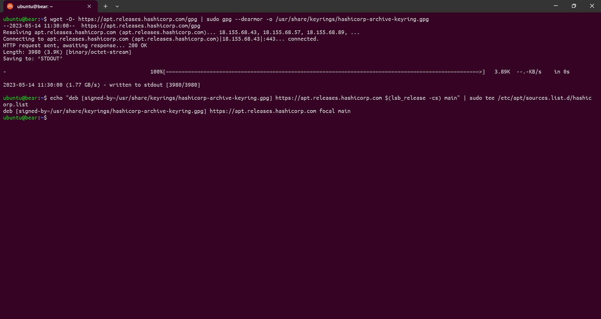

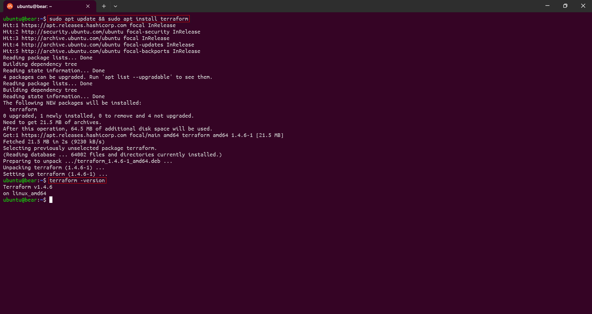

- Buat directori untuk server dan konfigurasi terraform. Lalu membuat script terraform `main.tf`.

```
terraform {
  required_providers {
    idcloudhost = {
      source = "bapung/idcloudhost"
      version = "0.1.3"
    }
  }
}

provider "idcloudhost" {
    auth_token = "" # API Token from idcloudhost.com
    region = "sgp01"
}

resource "idcloudhost_vm" "yyg-appserver" {
    name = "yyg-appserver"
    os_name = "ubuntu"
    os_version= "20.04"
    disks = 20
    vcpu = 1
    memory = 1024
    username = "yyg"
    initial_password = "" # Combination of Uppercase, Lowercase & Numbers
    billing_account_id =  # Billing ID from idcloudhost.com
    public_key = "" # SSH public key
    backup = false
}

resource "idcloudhost_vm" "yyg-gateway" {
    name = "yyg-gateway"
    os_name = "ubuntu"
    os_version= "20.04"
    disks = 20
    vcpu = 1
    memory = 1024
    username = "yyg"
    initial_password = "" # Combination of Uppercase, Lowercase & Numbers
    billing_account_id =  # Billing ID from idcloudhost.com
    public_key = "" # SSH public key
    backup = false
}

resource "idcloudhost_vm" "yyg-monitoring" {
    name = "yyg-monitoring"
    os_name = "ubuntu"
    os_version= "20.04"
    disks = 20
    vcpu = 2
    memory = 2048
    username = "yyg"
    initial_password = "" # Combination of Uppercase, Lowercase & Numbers
    billing_account_id =  # Billing ID from idcloudhost.com
    public_key = "" # SSH public key
    backup = false
}

resource "idcloudhost_floating_ip" "ip-yyg-appserver" {
    name = "yyg-appserver"
    billing_account_id = # Billing ID from idcloudhost.com
    assigned_to = idcloudhost_vm.yyg-appserver.id
}

resource "idcloudhost_floating_ip" "ip-yyg-gateway" {
    name = "yyg-gateway"
    billing_account_id = # Billing ID from idcloudhost.com
    assigned_to = idcloudhost_vm.yyg-gateway.id
}

resource "idcloudhost_floating_ip" "ip-yyg-monitoring" {
    name = "yyg-monitoring"
    billing_account_id =   # Billing ID from idcloudhost.com
    assigned_to = idcloudhost_vm.yyg-monitoring.id
}
```
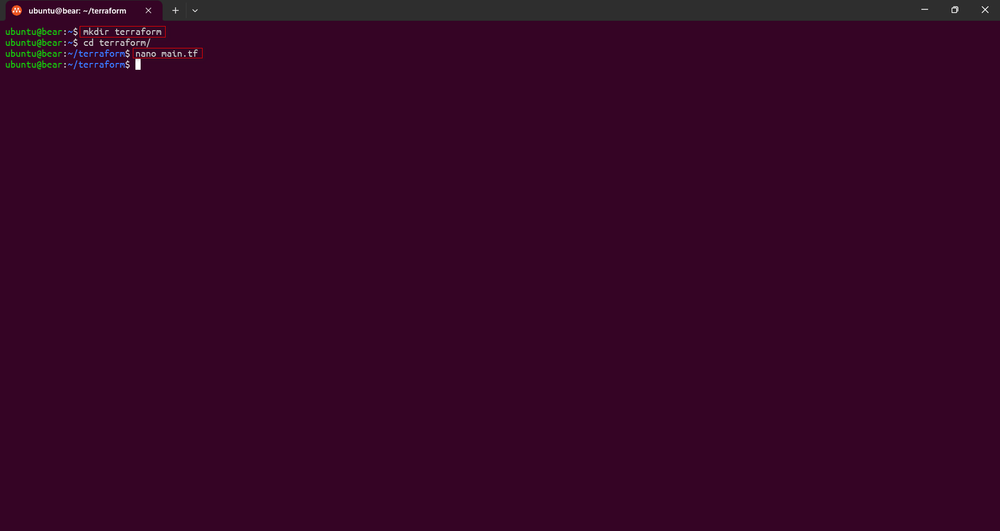

- Kemudian lakukan `Initialize` menyiapkan direktori kerja agar Terraform dapat menjalankan konfigurasi. Bisa gunakan perintah dibawah ini.

```
terraform init
```

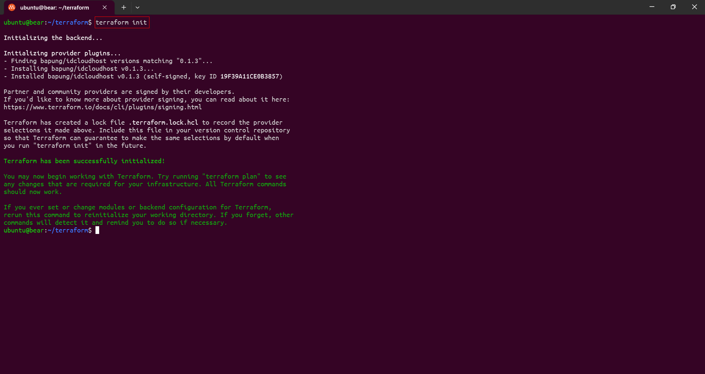


- Kemudian lakukan `Plan` memungkinkan melihat pratinjau setiap perubahan sebelum menerapkannya. Bisa gunakan perintah dibawah ini.

```
terraform plan
```

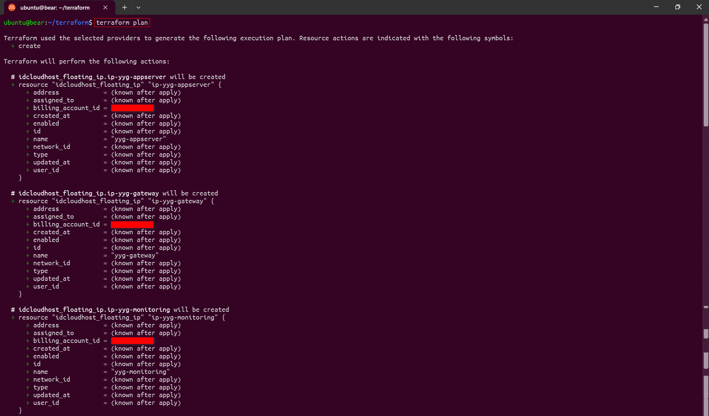

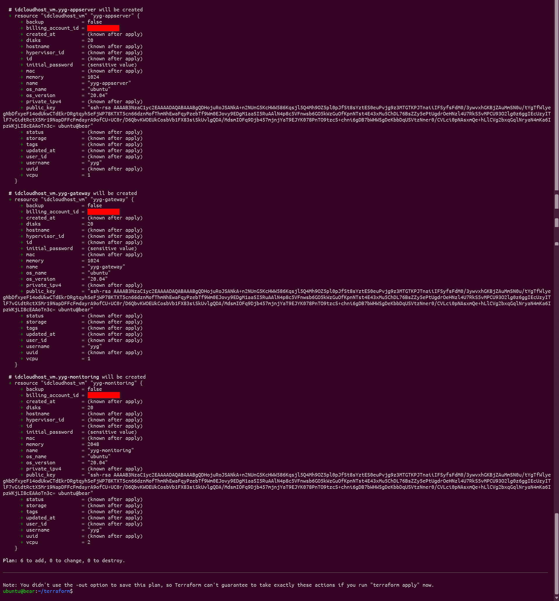


- Kemudian lakukan `Apply` membuat perubahan yang ditentukan oleh konfigurasi Terraform untuk membuat, memperbarui, atau menghancurkan sumber daya. Bisa gunakan perintah dibawah ini.

```
terraform apply
```

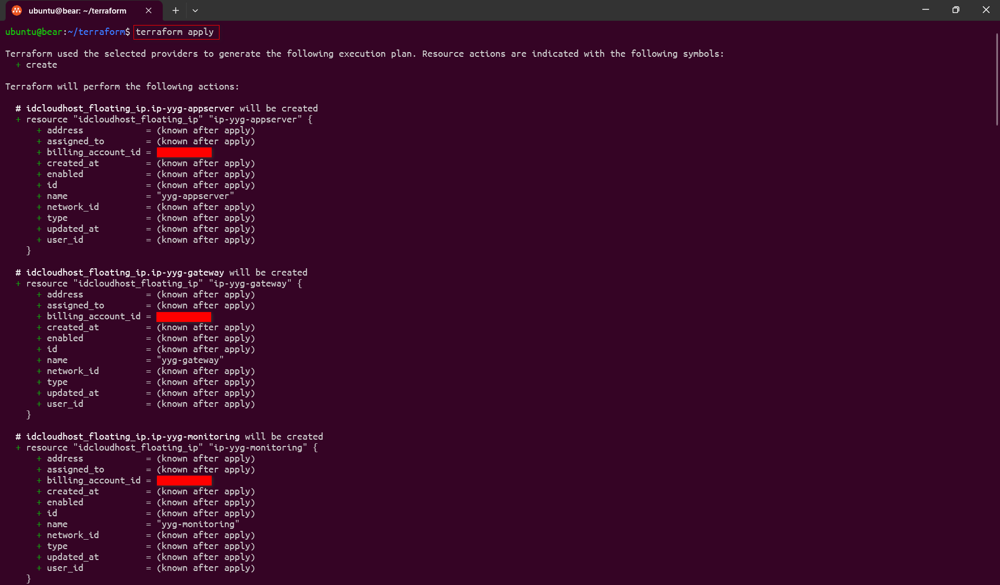

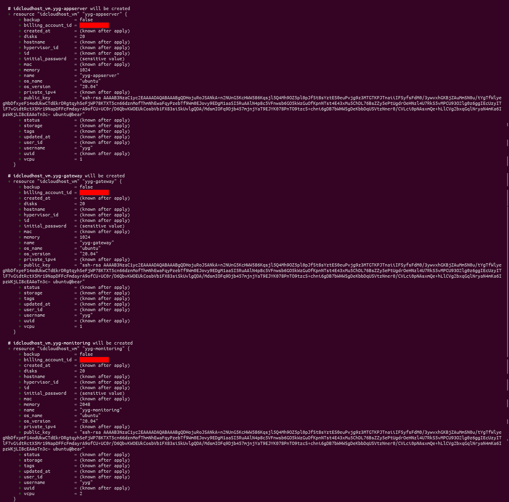

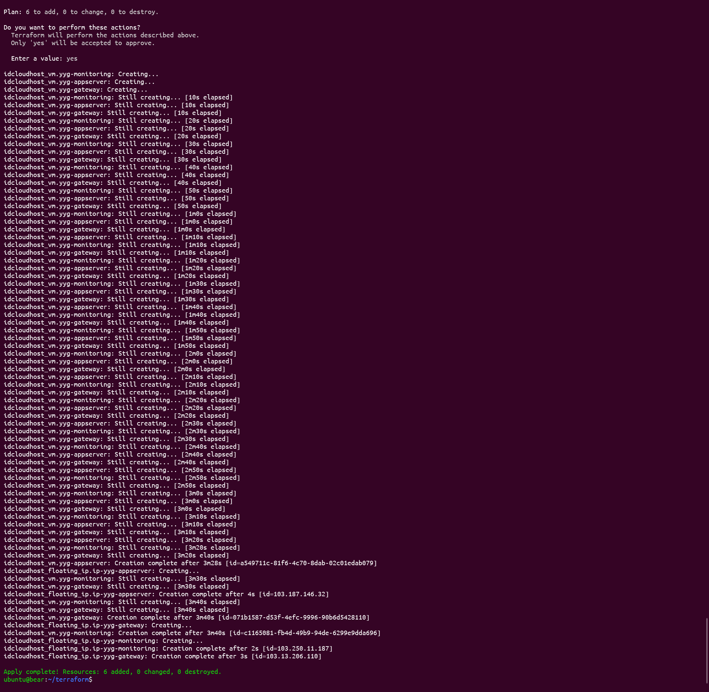

- Server dan floting IP telah berhasil dibuat.

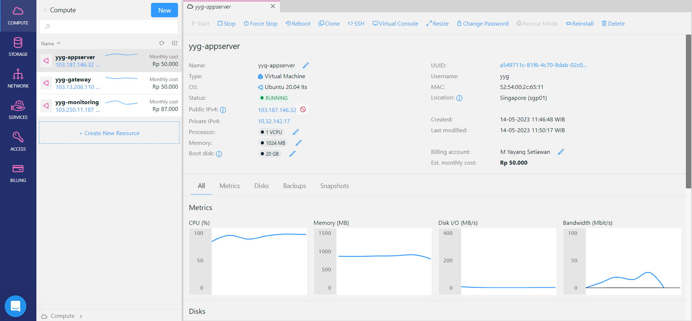

- Kemudian apabila tidak ingin menggunakan lagi server tersebut. Bisa gunakan perintah dibawah ini.

```
terraform destroy
```

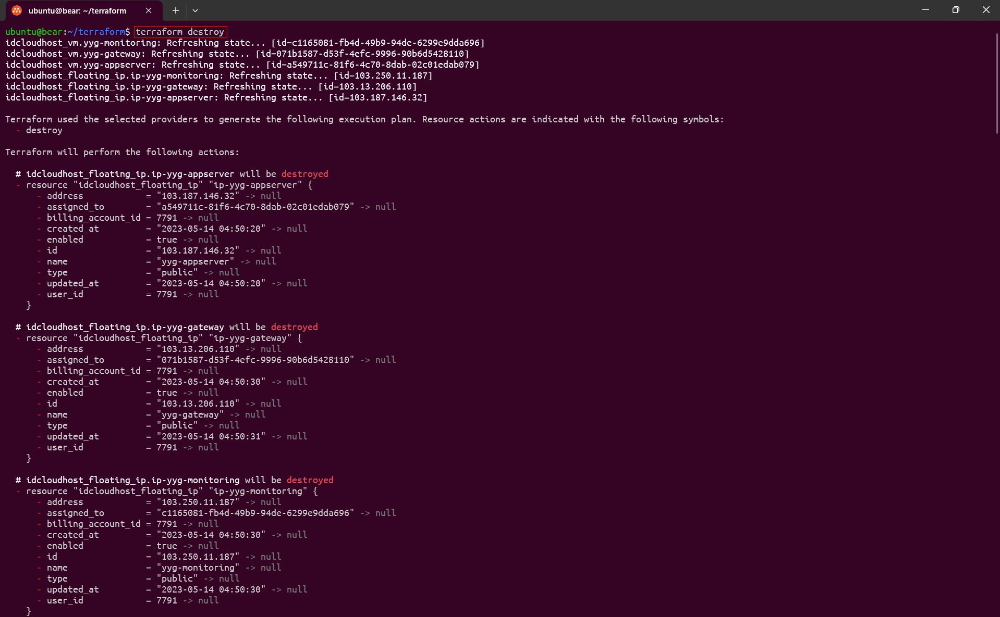

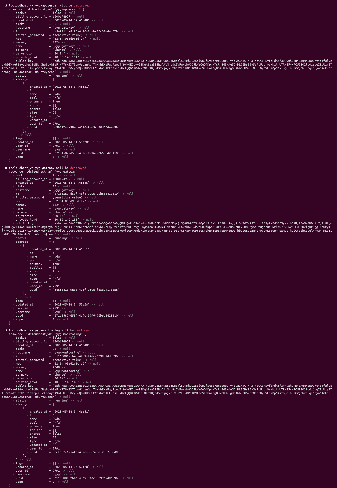

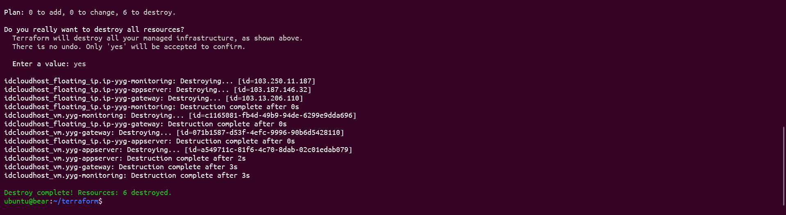